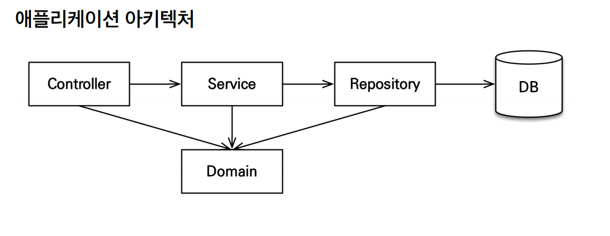

요구사항 분석

1. 회원기능
   - 회원등록
   - 회원조회
  
2. 상품기능
   - 상품등록
   - 상품수정
   - 상품조회

3. 주문기능
   - 상품주문
   - 주문내역조회
   - 주문취소

4. 기타 요구사항
  - 상품은 재고관리 필요
  - 상품의 종류는 도서, 음반 영화가 존재
  - 상품을 카테고리로 구분 가능
  - 상품 주문시 배송정보 입력

회원,주문,상품의 관계
- 회원은 여러상품 주문이 가능
- 주문 한건당 여러상품이 가능 > 주문과 상품이 다대다 관계
  ㄴ> 다대다 관계이므로, 그림처럼 주문상품이라는 엔티티를 추가하여 다대다 관계를 일대다, 다대일 관계로 처리
- 상품 분류의 경우 상품은 도서, 음반, 영화로 구분되는데 상품이라는 공통 속성을 사용하므로 상속 구조로 표현

#. 애플리케이션 아키텍쳐

계층형 구조 사용
- controller, web: 웹 계층
- service: 비즈니스 로직, 트랜잭션 처리
- repository: JPA를 직접 사용하는 계층, 엔티티 매니저 사용
- domain: 엔티티가 모여 있는 계층, 모든 계층에서 사용

패키지 구조
- jpabook.jpashop
- domain
- exception
- repository
- service
- web

개발 순서: 서비스, 리포지토리 계층을 개발하고, 테스트 케이스를 작성해서 검증, 마지막에 웹 계층 적용

